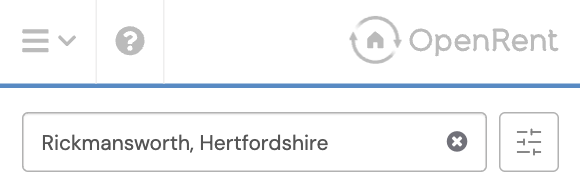
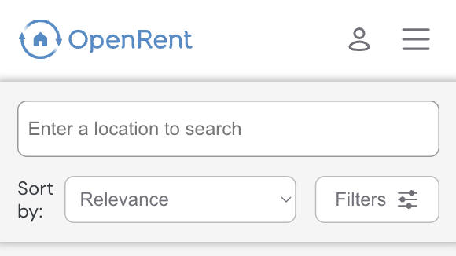
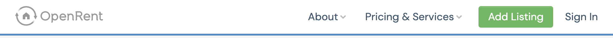
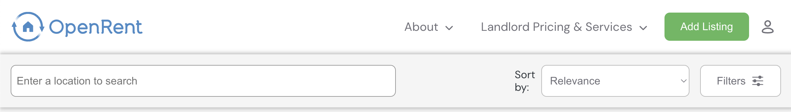
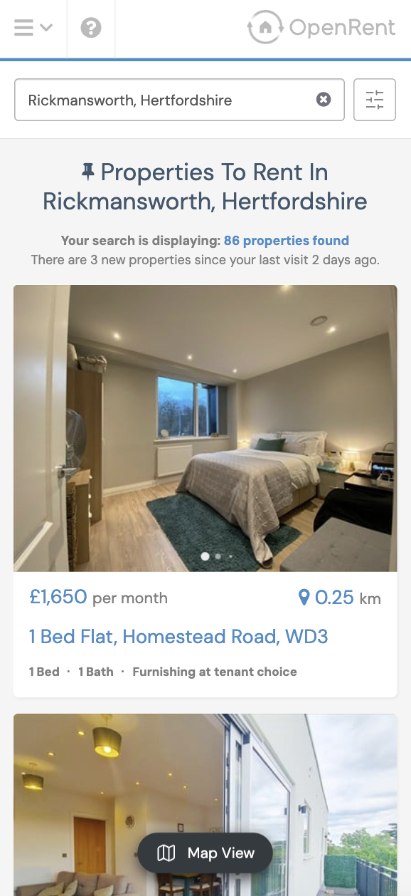
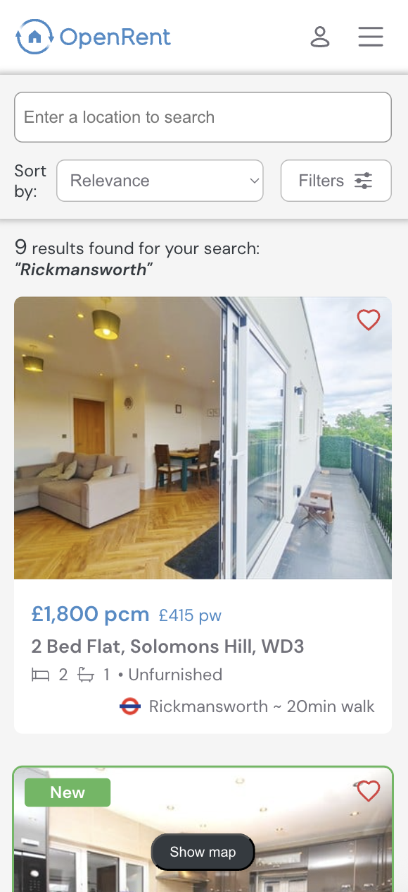
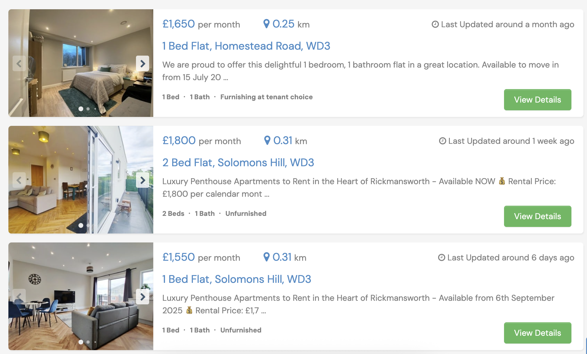
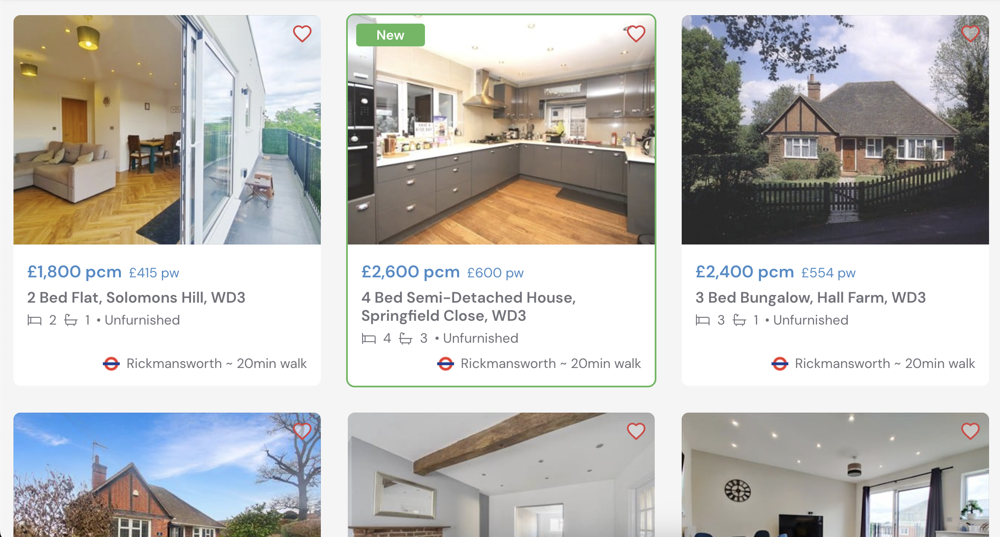
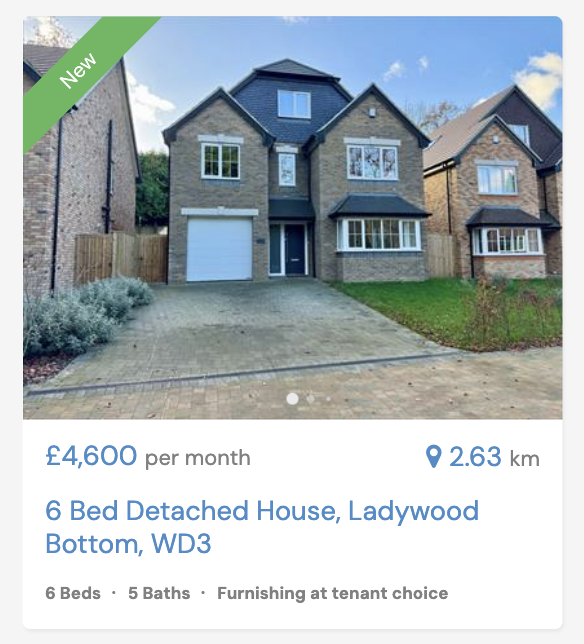
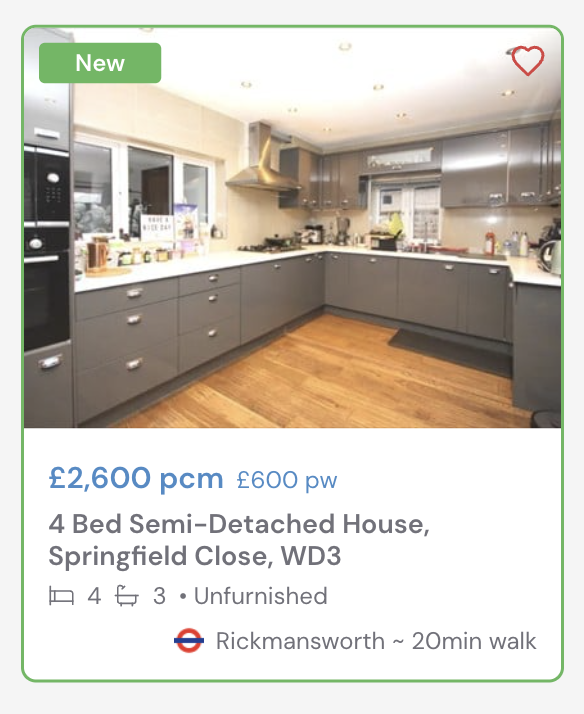

# OpenRent - New Listings Page

Here is my new vision for the listings page on OpenRent. I have built this in React but its a PoC so functionality is limited for demonstration purposes. My thought process can be seen below, but to run this locally please just clone this repo, run `npm i` and then `npm run dev`, this will then be accessible via `http://localhost:5173/`. This was built in Chrome so its untested in other browsers.

## Changes

For inspiration for a new UI, I looked at other sources such as AirBnb, RightMove, Hotels.com and then checked the existing UX to see where we could make some enhancements. I did notice right away that OpenRent doesn't have a full responsive experience as loading in desktop/mobile first and then changing the viewport has some breaking experiences. Because of that I wanted to try and make a truely responsive experience making the listings and the header scale as nice as possible. 

### Header

For the first change, I started with the header to come up with a solution which could make searching a bit easier. On mobile, it seemed quite cluttered so I modernised it a little and made a sticky search input (with filters and sort) being more prominent.

Before:

After:

I sacrificed a little more space height wise as I thought visible sort functionality would be useful for this type of experience. 

You will also noticed I switched the view around. This was to make responsiveness easier but also having actions on the right hand side is a little more inuitive as this is a common pattern and a lot more users are right handed. An added change I made was to make the OpenRent logo stand out more and gave it the iconic blue colour.

On desktop the UI is very similar as to what it was before but again, just sharpened it up a litte

Before:

After:

I changed the name of the link `Pricing & Services` to `Landlord Pricing & Services` as to me at least it wasn't clear (until you opened the menu) who was to pay for any of this. This to me saves cognitive load for renters.

### Listings View

Again for the responsiveness to work well I decided to adopt the same card style listing throughout mobile and desktop. Although already existing on the current mobile experience, I felt the desktop experience benefits to having a much cleaer image from the start and there is the potential to see more listings in view when in a grid layout. 

Before:

After:

Here I changed a few bits of the UI, hopefully to the benefit of the user. 

- Firstly I added a "like" functionality (working in demo). Seems a pretty standard feature these days so its a nice addition.

- Pricing, I kept the same look and feel of this really but thought maybe it was better to include the weekly breakdown as well instead of this being an optional filter. Makes it more transparent and saves user having to try and find where to go.

- I was a little confused by the location aspect, distance from wasn't clear where it was from/to other than the predetermined location searched for. I didn't find this useful, instead I have suggested to bring a nearest landmark or transport link from the product page as that could be more useful to understand location.

- I also felt using icons for bed and bath information was a more modern look and easier to digest quickly compared to reading the information.

Before:

After:

For desktop above, you can see the grid view in play which allows for more to be shown. I droped the CTA of the View details as that is implied by the card being clickable anyway. I also kept the map view at the top (just an image in the demo) as that requires more thought and a larger change to adapt to.

### New Listing

I attempted to update the UI for the New listing experience on the card. Previously it was just a banner but I felt perhaps we could make this jump out a bit more so added a badge to the top and a green border. This could be extended to other types of states like "Premium Listing" etc.

Before:

After:

## Final notes

Hopefully this showcases my thoughts and rationale well. It was fun to create a new experience in a PoC and to think about new ideas. 

Apologies this was not with any official designs, I wanted to push myself and create an experience as best I could. I did spend more than the 2 hours (probably ~5) but I felt it was worth putting the effort in then just stopping at the 2 hour mark. If there are any issues please reach out. 